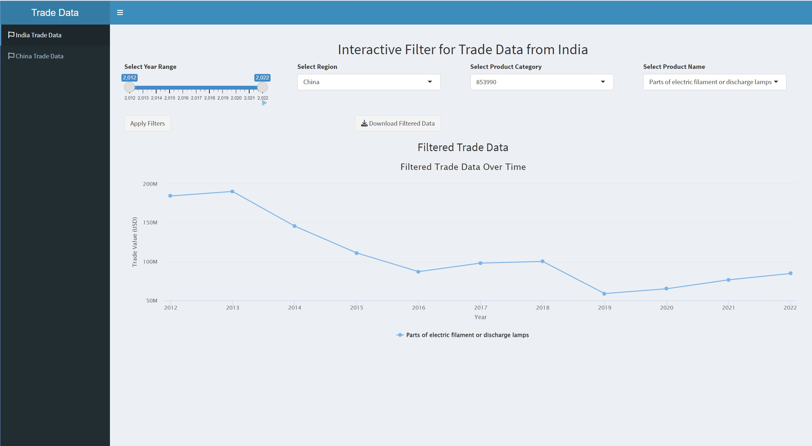
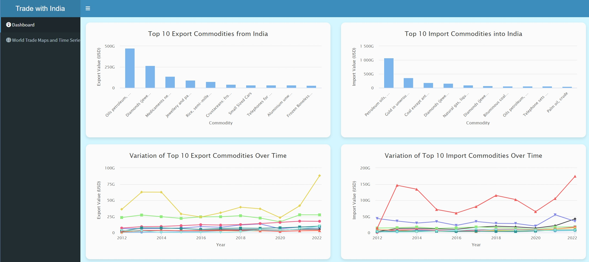
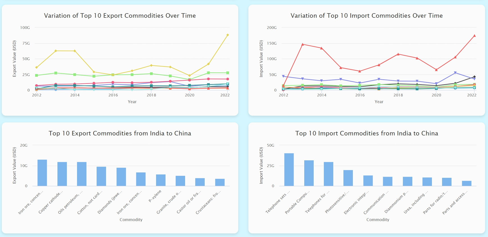
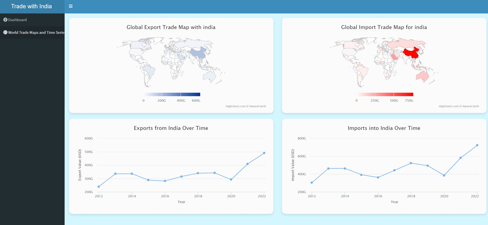
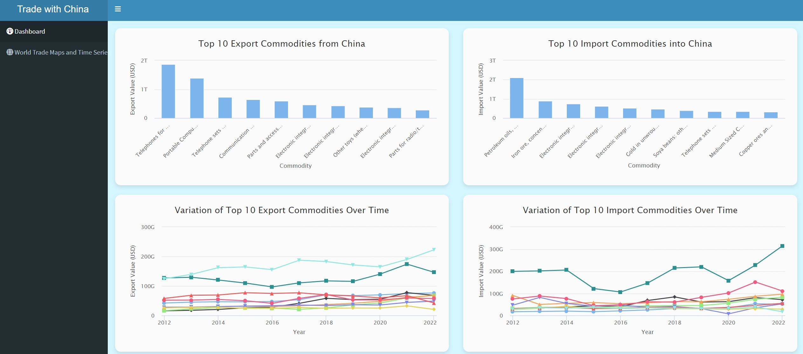

# India-China Trade Data Dashboard

This repository contains an R-based dashboard designed to analyze trade data between India and China. The dashboard provides an interactive and user-friendly interface to explore trade patterns, trends, and key insights.

## Features

- **Interactive Visualization**: View trade volumes, exports, and imports between India and China over time.
- **Custom Filters**: Filter data by year, trade categories, and commodity types.
- **Dynamic Insights**: Identify significant trends, growth patterns, and trade imbalances.
- **Exportable Reports**: Download analyzed data and visualizations for offline use.
- **Customizable Interface**: Adjust visualization styles and layout for tailored analysis.

## Tech Stack

- **Programming Language**: R
- **Dashboard Framework**: Shiny
- **Visualization Libraries**: ggplot2, plotly
- **Data Manipulation**: dplyr, tidyr

## Prerequisites

Ensure the following are installed on your system:

- [R](https://cran.r-project.org/) (version >= 4.0.0)
- [RStudio](https://www.rstudio.com/) (optional, but recommended)
- Required R packages:
  - shiny
  - ggplot2
  - plotly
  - dplyr
  - tidyr
- **Additional Tools**:
  - A working internet connection for live data updates (if applicable).
 
-  Download the trade data: https://drive.google.com/file/d/1fIA4nHP22HB6TLUElrfDYGjlFfQoIITv/view?usp=sharing

 ## Screenshots

### Dashboard Home


### Filter View



### Trade Trends




You can install the required packages using:

```R
install.packages(c("shiny", "ggplot2", "plotly", "dplyr", "tidyr"))
